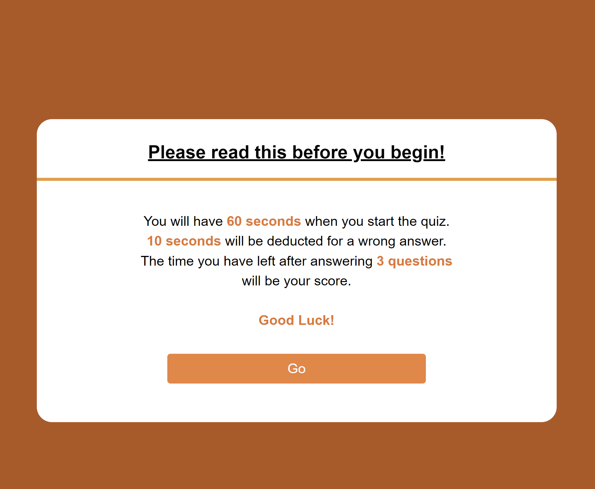
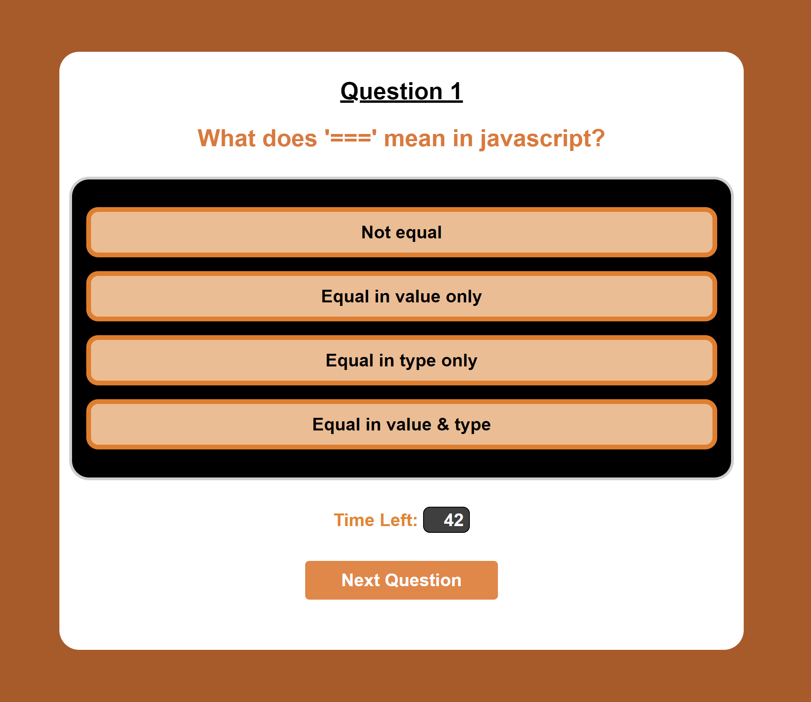
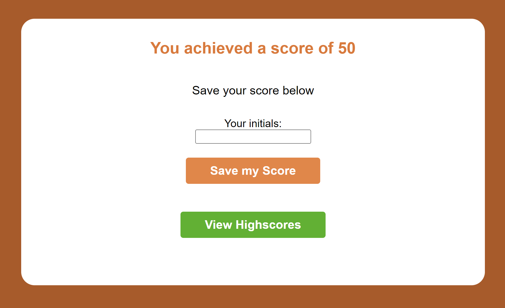
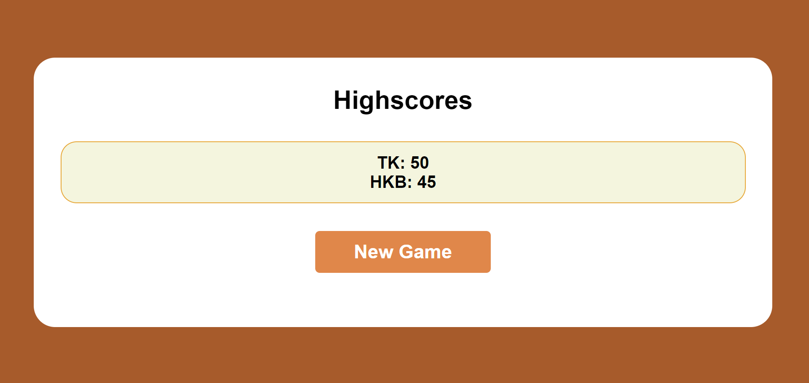
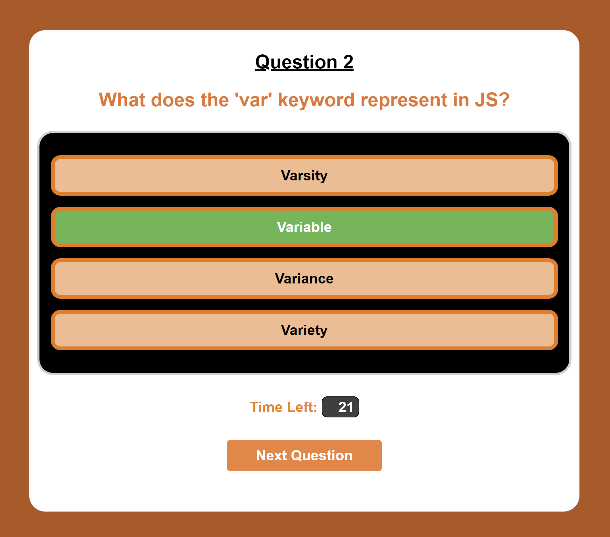
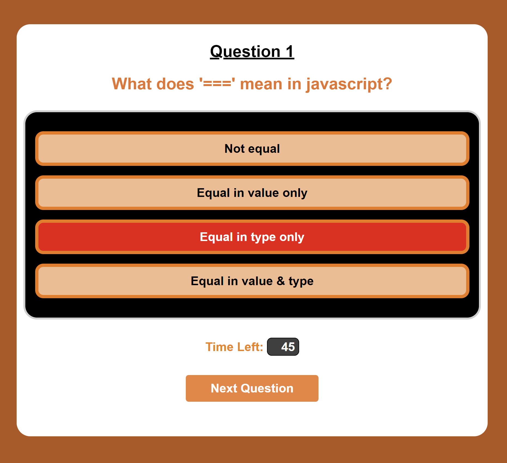
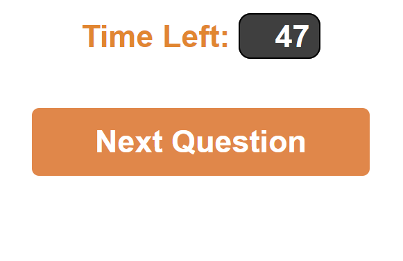

# Quiz me

This is a quiz game made to test your knowledge in Javascript. It asks the player questions related to JS and gives four options that you can choose from. A timer of 60 seconds starts counting down when the quiz begins and answering incorrectly results in a penlaty of 10 seconds. Your score is the remaining time after all questions have been answered. The score can then be saved with your name and it will be displayed in the highscore gallery for you to compare with others.

 

# Deployed link

You can try out the quiz by visiting the link below:   
<a href= "https://moecancode.github.io/Quiz-me/">Quiz-me</a>

 

# Layout

The webpage has a simple layout with a vibrant color theme to look appealing. It is very eas to understand and navigate through the quiz without having to waste time on trying to understand how things work.

 

 

# Working

Users have to select answers for a series of questions and are given a time limit of 60 seconds to answer them all. Correct answers maintain the time left while wrong answers result in a 10-second penalty.

 

 

Once the user has answered all questions, they will be shown their score and will be prompted to enter their initials so that their score can be saved in the local storage.

 

 

Users can then go to the highscore gallery and compare their standings with other users that have played the game. They can also choose to play again if they wish.

 

 

# Features

A couple of notable features were added to ensure a nice user experience when playing the game:

## 1. Color highlights upon selection

When a user chooses an option as their answer, the option is colored Red if the answer is incorrect and Green if it is correct.

 

 

 

## 2. Disabled buttons until an option is selected

 

The "Next Question" button is disabled until the user answers a question. This ensures that all questions are answered and a fair score is calculated.

 

 

# Contributors

**Mohammad Abuzar Razvi**

 

# License

MIT License

Copyright (c) [2022] [Mohammad Abuzar Razvi]

Permission is hereby granted, free of charge, to any person obtaining a copy
of this software and associated documentation files (the "Software"), to deal
in the Software without restriction, including without limitation the rights
to use, copy, modify, merge, publish, distribute, sublicense, and/or sell
copies of the Software, and to permit persons to whom the Software is
furnished to do so, subject to the following conditions:

The above copyright notice and this permission notice shall be included in all
copies or substantial portions of the Software.

THE SOFTWARE IS PROVIDED "AS IS", WITHOUT WARRANTY OF ANY KIND, EXPRESS OR
IMPLIED, INCLUDING BUT NOT LIMITED TO THE WARRANTIES OF MERCHANTABILITY,
FITNESS FOR A PARTICULAR PURPOSE AND NONINFRINGEMENT. IN NO EVENT SHALL THE
AUTHORS OR COPYRIGHT HOLDERS BE LIABLE FOR ANY CLAIM, DAMAGES OR OTHER
LIABILITY, WHETHER IN AN ACTION OF CONTRACT, TORT OR OTHERWISE, ARISING FROM,
OUT OF OR IN CONNECTION WITH THE SOFTWARE OR THE USE OR OTHER DEALINGS IN THE
SOFTWARE.